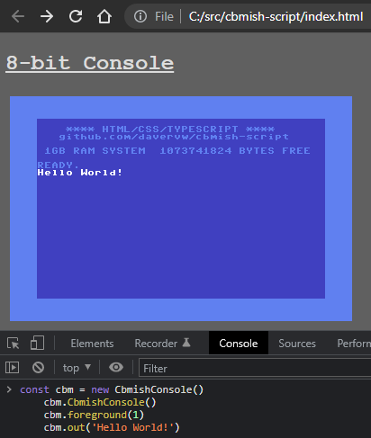

# cbmish-script #

## About ##

Console (display output) that has features resembling an 8-bit classic system.  It's purpose is to give a retro vibe yet use modern tools, languages.

* CbmishConsole is a TypeScript class that in conjunction with HTML/CSS provides a C64 appearance screen which can be used to output strings, etc.  Methods are provided to adjust colors, output an object (that is converted to string), and even poke to color and screen memory if that's your thing.
* No BASIC is provided, you are expected to code in your own JavaScript.   Empty sample.cs is provided, otherwise use your browser's developer tools to code interactively.

## Build ##

To build the JavaScript .js files referenced by index.html, use tsc (TypeScript compiler), available via npm, and can run in the background

    tsc -w cbmish.ts c64font.ts sample.ts

## Sample ##

Sample usage from developer tools console:

    const cbm = new CbmishConsole()
    cbm.CbmishConsole()
    cbm.foreground(1)
    cbm.out('Hello World!')

## Hint ##

(Hint: to change rows/columns, adjust the height/width attributes (in pixels) of the screen canvas in the HTML file.  The class will divide each by 8 pixels.   For example, try changing width attribute to 640 for an 80 column screen, then manually zoom the screen to see it better.)
